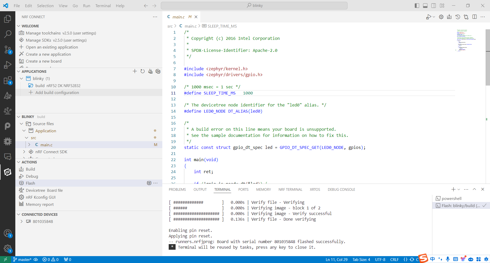
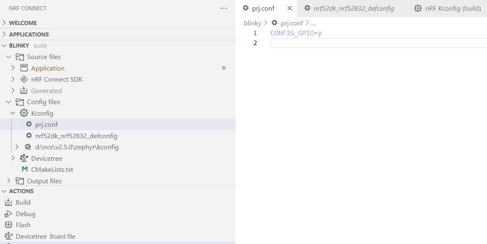
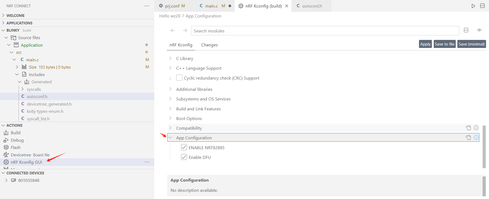
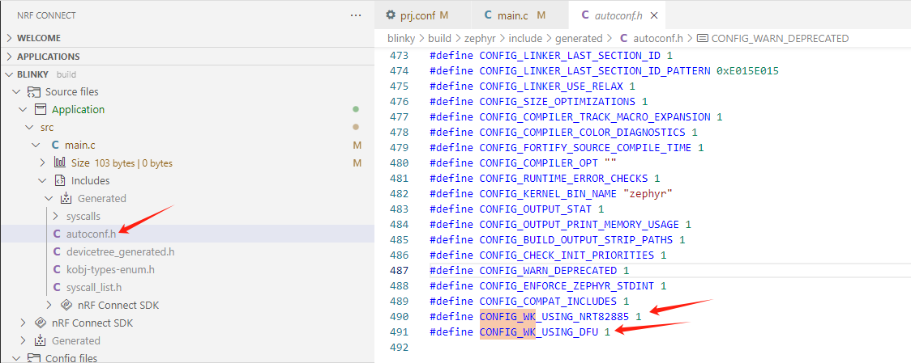
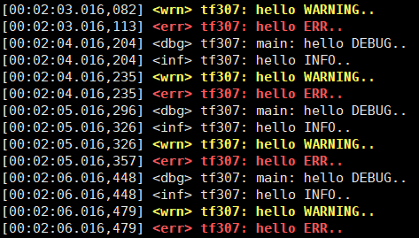

# NCS基础开发

## NCS介绍、按键与LED控制

NCS（Nordic Connect SDK）是由诺德半导体（Nordic Semiconductor）提供的一款针对其无线产品线的全功能软件开发套件。它旨在帮助开发人员快速构建和部署基于Nordic Semiconductor芯片的无线连接应用程序，包括蓝牙（Bluetooth）、Thread、Zigbee等。

NCS提供了丰富的功能和工具，包括：

1. 高级蓝牙协议栈（SoftDevice）：NCS内置了最新的蓝牙协议栈，支持最新的蓝牙5.0、5.1和5.2规范，以及蓝牙Mesh和蓝牙Long Range等功能。

2. 示例代码和应用程序模板：NCS提供了丰富的示例代码和应用程序模板，覆盖了各种应用场景和功能，帮助开发人员快速入门并快速开发应用。

3. 周边库和驱动程序：NCS提供了丰富的周边库和驱动程序，涵盖了各种传感器、外设和接口，方便开发人员与外部硬件进行交互。

4. 兼容性和标准：NCS与Nordic Semiconductor的硬件平台完全兼容，同时也与Zephyr RTOS（实时操作系统）兼容，开发人员可以在Zephyr的基础上进行深度定制和开发。

### 开发环境搭建

打开NCS首页https://developer.nordicsemi.com/nRF_Connect_SDK/doc/2.5.0/ 所有资料均在开发手册。为了快速搭建开发环境使用Installing automatically安装方式（强烈建议使用Installing manually安装方式）。安装步骤按照文档依次进行即可，英文资料适当翻译后理解，注意如下几点：

1. 报错，编译下载过程中，如果出现报错信息，切记不要心急，认真分析翻译，适当借助ChatGPT/Gemini等辅助翻译工具；
2. 安装依赖，Python安装后要添加到环境变量，若不确定是否已经安装Python可在命令行模式下python -v查看输出的版本信息；
3. 安装SEGGER J-Link驱动，注意版本和NCS匹配，如果出现无法识别/下载程序情况，可尝试其它版本驱动；
4. 安装nrfjprog命令行，该命令集合用于Nordic系列单片机擦除、下载等操作；
5. 安装nRF Connect for Desktop，下载工具链、SDK时可能要尝试科学上网方式，否则容易失败，导致文件不完整出现工程无法使用情况。

### Blinky示例运行

参考Zephyr的工程示例 https://docs.zephyrproject.org/3.5.0/samples/basic/blinky/README.html 。一些基础工程NCS不包括在其Samples中，直接参考Zephyr工程示例即可，内附有详细的工程使用说明。

一、工程文件结构

```
<app>
├── CMakeLists.txt
├── app.overlay
├── prj.conf
├── VERSION
└── src
    └── main.c
```

上述文件结构是一个应用程序的基础框架。CMakeLists.txt 文件是 CMake 构建系统的重要组成部分，用于**描述项目的构建过程和配置**，例如：project(blinky)表示工程名称是blinky，可通过网络资源查询到更丰富的语法；app.overlay文件是Zephyr操作系统中一种方便的应用**设备树定制**机制，可以用于定制应用的设备树配置、修复设备树错误、适配不同硬件平台等；prj.conf文件（项目配置文件）是用于 **定制特定应用程序内核配置** 的重要文件，主要作用是覆盖或扩充由板级配置和 Zephyr 内核本身建立的默认内核配置；VERSION文件用于存储版本信息；src文件夹内存放应用程序所有的源代码。

二、开发工具结构



所有的开发工作都基于VSCode的nRF Connect插件。WELCOME菜单，主要包含基本设置，例如工具链版本、SDK版本和创建/打开应用等，点击“Create a new application”选择从工程中Copy一个例程blinky然后选择存储路径；APPLICATIONS菜单，显示当前打开的所有工程，可选择不同的目标板进行构建；BLINKY菜单，根据具体的工程名称变化，显示对应的源代码和配置文件等；ACTIONS菜单，主要用于构建下载等操作；CONNECTED DEVICES菜单，显示当前连接的目标板，此处可以连接多个目标板，可根据需要选择对某一个目标板进行调试。

对工程进行编译下载，即可看到LED1周期性闪烁，表明基本开发环境已经搭建成功。


## 工程配置与设备树

### 工程配置

Kconfig 是一种宏语言，用于 Linux内核和其他嵌入式系统项目（例如 Zephyr）在构建过程中管理内核配置选项。它提供了一种定义、描述和操作配置选项的方法，允许开发人员根据其特定需求定制内核。前文描述的prj.conf文件是面向用户侧的核心配置文件，其位于BLINK->Config files->Kconfig路径下。文件内，每一行为一个控制配置，均以CONFIG_开头。CONFIG_GPIO=y表示启用GPIO功能，CONFIG_BT=y表示启用蓝牙功能。其它更多配置可阅其它示例工程的prj.conf文件，例如：CONFIG_I2C=y，表示开启IIC功能。



nrf52dk_nrf52832_defconfig文件为Nordic官方默认的工程配置，所有的nrf52dk开发板均共享同一个默认配置，其路径zephyr\boards\arm\nrf52dk_nrf52832而不是每一个工程独自的配置。在VSCode编辑器内一般悬停即可看到配置的具体含义，随着工程开发数量的增加将会慢慢熟悉各个宏的作用。

```
# SPDX-License-Identifier: Apache-2.0
CONFIG_SOC_SERIES_NRF52X=y
CONFIG_SOC_NRF52832_QFAA=y
CONFIG_BOARD_NRF52DK_NRF52832=y
# Enable MPU
CONFIG_ARM_MPU=y
# Enable hardware stack protection
CONFIG_HW_STACK_PROTECTION=y
# Enable RTT
CONFIG_USE_SEGGER_RTT=y
# enable GPIO
CONFIG_GPIO=y
# enable uart driver
CONFIG_SERIAL=y
# enable console
CONFIG_CONSOLE=y
CONFIG_UART_CONSOLE=y
CONFIG_PINCTRL=y
```

CONFIG_ARM_MPU=y宏用于启用 ARM 处理器的内存保护单元 (MPU) 支持；CONFIG_USE_SEGGER_RTT=y宏用于启用 SEGGER J-Link 的实时传输 (RTT) 通信协议，该协议适用于基于 ARM 的系统。RTT 提供了一种可靠高效的机制，用于在调试和开发过程中在目标设备和主机计算机之间传输数据；CONFIG_CONSOLE=y宏用于启动控制台功能；CONFIG_UART_CONSOLE=y宏用于启用串口作为控制台。

### 自定义工程配置（Kconfig实战）

详细的Kconfig可参阅官方文档https://docs.zephyrproject.org/latest/build/kconfig/index.html 。在Zephyr的项目工程中，默认会到项目目录下去寻找Kconfig文件。如果没有找到，就会默认使用Zephyr根目录下Kconfig文件。Zephyr根目录的Kconfig文件会去读取同目录下的Kconfig.zephyr文件（该文件很关键！！！ Zephyr 内核提供的基本功能和参数都从这个文件中配置）。在实际的项目过程中，如果在工程的目录下面自己定义Kconfig，一定要引用一下zephyr目录下的Kconfig.zephyr文件，自定义的Kconfig文件如下：

```
# 配置界面的标题，它通常位于 Kconfig 文件的顶部
mainmenu "Hello wz20"
# 引用zephyr目录下的默认配置
source "Kconfig.zephyr"
# 定义配置界面的菜单项
menu "App Configuration"
	# 配置一个宏默认是启用的
    config WK_USING_NRT82885
        bool "ENABLE NRT82885"
        default y 
	# 配置一个宏默认是启用的
    config WK_USING_DFU
        bool "Enable DFU"
        default y 
endmenu
```

使用可视化功能“nRF Kconfig GUI”能看到新添加的自定义配置：



重新构建工程后可在autoconf.h文件中看到2个宏定义，可在其它C源文件和头文件中引用。



```c
// main.c文件中适当位置添加条件编译，输出窗口能看到using dfu yes的提示
#ifdef CONFIG_WK_USING_DFU
#warning "using dfu yes"
#endif
```

可在prj.conf文件中将默认启动改为默认停用，CONFIG_WK_USING_NRT82885=n或者CONFIG_WK_USING_DFU=n即可，为工程的开发提供了很强的灵活性。

### 设备树

设备树（Device Tree）是一种描述硬件信息的的数据结构，或称为硬件描述语言，用于在 Linux 内核和其他嵌入式操作系统中配置和管理设备。它提供了一种结构化和标准化的方式来描述设备的连接、中断、寄存器、时钟和其他属性，简化了硬件配置和初始化过程。

设备树的主要特点：

- **结构化描述:** 设备树采用树状结构来组织设备信息，每个节点代表一个设备或设备组，并包含该设备的属性和子节点。这种结构化方式使设备信息更加清晰易懂。
- **标准化格式:** 设备树使用标准的文本格式（通常是 DTS 或 DTB），方便不同的平台和工具之间共享和解析。
- **动态配置:** 设备树可以在启动过程中动态解析和应用，允许在运行时根据需要配置设备。

设备树的优势：

- **提高硬件抽象:** 设备树将硬件配置与内核代码分离，提高了硬件抽象层（HAL）的灵活性和可维护性。
- **简化设备配置:** 设备树提供了一种统一的配置方式，简化了不同硬件平台的配置和管理。
- **支持动态配置:** 设备树支持动态配置，允许在运行时根据需要添加或移除设备。
- **增强系统灵活性:** 设备树提高了系统的灵活性和可扩展性，方便添加新设备或修改现有设备配置。

设备树的应用：

- **Linux 内核:** 设备树是 Linux 内核中用于设备管理的主要方式，支持广泛的硬件平台。
- **嵌入式操作系统:** 许多嵌入式操作系统，例如 Zephyr 和 U-Boot，也支持设备树。
- **硬件开发:** 设备树被广泛用于硬件开发，方便硬件厂商提供设备信息和配置描述。

官方手册https://docs.zephyrproject.org/latest/build/dts/index.html 。


所有 Zephyr 内核和应用程序源代码文件都可以包含并使用 `devicetree.h` 头文件。这涵盖了设备驱动、应用程序、测试用例、内核等等。该 API 本身基于 C 宏实现。所有宏名称都以 `DT_` 开头。一般来说，如果在 Zephyr 源文件中看到以 `DT_` 开头的宏，它很可能是来自 `devicetree.h` 的宏。生成的 C 头文件也包含以 `DT_` 开头的宏。

设备树示例：

```
/dts-v1/;
/ {
        a-node {
                subnode_nodelabel: a-sub-node {
                        foo = <3>;
                };
        };
};
```

`/dts-v1/;`指定设备树的语法版本为1。上述设备树有三个节点 `/`、`a-node`、`a-sub-node`，节点可以添加`节点标签`，`subnode_nodelabel`是`a-sub-node`的节点标签，一个节点可以有0、1、多个节点标签，可以通过不同的节点标签访问到该节点，foo是节点的属性，其值是3。在 Zephyr 设备树中，每个节点都拥有一个路径，用于标识其在树中的位置。就像 Unix 文件系统路径一样，设备树路径也是由斜杠 (/) 分隔的字符串。根节点的路径为单个斜杠 (`/`)。其他节点的路径则由其父节点的名称和自身名称连接而成，中间用斜杠分隔。例如，节点 `a-sub-node` 的完整路径为 `/a-node/a-sub-node`。

## 日志与控制台(串口)

日志（Logging）作为调试的利器，在Zephyr中作为操作系统的基本服务存在（资料位于https://docs.zephyrproject.org/latest/services/logging/index.html） ，通过配置实现启停。日志服务提供4个等级的输出：error、warning、info和debug，其API接口位于`include/zephyr/logging/log.h`路径下。

Kconfig配置：

`CONFIG_LOG`：全局开关日志服务；

`CONFIG_LOG_BACKEND_XXX`：日志后端使用XXX，其中XXX可以是UART、RTT等；

`CONFIG_LOG_BUFFER_SIZE=4096`：日志缓存空间设置4KB。

为了在模块里面使用日志并作为日志区分，需要给本模块取一个别名，同时需要使用`LOG_MODULE_REGISTER`注册，并指定日志等级，低于日志等级的则不输出，高于则输出，非常方便日常开发调试。

```
#include <zephyr/logging/log.h>
LOG_MODULE_REGISTER(foo, LOG_LEVEL_DBG);
```

在.c文件中直接调用LOG_ERR、LOG_WRN、LOG_INF、LOG_DBG即可看到日志输出（建议使用xshell之类工具，而非串口助手），并且不同等级有不同颜色区分，非常利于辨识。



```c
while (1) 
{
    ret = gpio_pin_toggle_dt(&led);
    if (ret < 0) 
    {
    	return 0;
    }
    k_msleep(SLEEP_TIME_MS);
    LOG_DBG("hello DEBUG..");
    LOG_INF("hello INFO..");
    LOG_WRN("hello WARNING..");
    LOG_ERR("hello ERR..");
}
```

在blinky工程实践。

shell控制台，类Unix的shell，在Zephyr中作为操作系统的基本服务存在（资料位于https://docs.zephyrproject.org/latest/services/shell/index.html ），Kconfig配置：

`CONFIG_SHELL`：全局开关shell服务；

`CONFIG_SHELL_BACKEND_XXX`：日志后端使用XXX，其中XXX可以是SERIAL、RTT等；

`CONFIG_SHELL_STACK_SIZE=4096`：日志缓存空间设置4KB。

```c
#include <zephyr/shell/shell.h>
static int gain_cmd_handler(const struct shell *sh,	size_t argc, char **argv, void *data)
{
	int gain;
	gain = (int)data;
	// adc_set_gain(gain);
	shell_print(sh, "ADC gain set to: %s Value send to ADC driver: %d", argv[0], gain);
	return 0;
}
SHELL_SUBCMD_DICT_SET_CREATE(sub_gain, gain_cmd_handler,
							 (gain_1, 1, "gain 1"), (gain_2, 2, "gain 2"),
							 (gain_1_2, 3, "gain 1/2"), (gain_1_4, 4, "gain 1/4"));
SHELL_CMD_REGISTER(gain, &sub_gain, "Set ADC gain", NULL);
```

## 多线程

Zephyr 是一个轻量级的实时操作系统 (RTOS)，用于构建嵌入式系统。它提供了一个简单的 API 来创建和管理线程，并支持多种调度算法。多线程是一种并发编程技术，允许在一个程序中同时执行多个任务。这对于提高应用程序的性能和响应能力很有帮助，特别是在处理多个独立任务或处理需要大量计算的任务时。手册请参阅 https://docs.zephyrproject.org/3.4.0/kernel/services/threads/index.html 

Zephyr 中的线程由以下几个部分组成：

- **线程控制块 (TCB)：** 存储有关线程状态和上下文的信息，包括线程堆栈、优先级、状态等。

- **线程堆栈：** 用于存储线程的局部变量和函数调用栈。

- **线程函数：** 线程要执行的代码。

  例如，以下代码创建一个线程：

```c
#define WK_STACK_SIZE 500
#define WK_PRIORITY 5
extern void my_entry_point(void *, void *, void *);
K_THREAD_STACK_DEFINE(wk_stack_area, WK_STACK_SIZE);
struct k_thread wk_thread_data;
k_tid_t wk_tid = k_thread_create(&wk_thread_data, wk_stack_area,
                                 K_THREAD_STACK_SIZEOF(wk_stack_area),
                                 my_entry_point,
                                 NULL, NULL, NULL,
                                 WK_PRIORITY, 0, K_NO_WAIT);
```

 `k_thread_create` 创建线程时各个参数含义：

- `&wk_thread_data`：线程控制块指针。
- `thread_stack`：线程堆栈。
- `STACK_SIZE`：堆栈大小。
- `my_entry_point`：线程函数指针。
- `NULL, NULL, NULL`：传递给线程函数的参数。
- `WK_PRIORITY`：线程优先级。
- `0`：线程选项。
- `K_NO_WAIT`：线程创建后立即开始运行。

创建完成线程后，需要调用`k_thread_start()`函数启动线程。或者，可以通过调用 K_THREAD_DEFINE **在编译时声明线程**。 宏自动定义堆栈区域、控制块和线程 ID 变量。 下面的代码与上面的代码段具有相同的效果。

```c
#define MY_STACK_SIZE 500
#define MY_PRIORITY 5

extern void my_entry_point(void *, void *, void *);

K_THREAD_DEFINE(my_tid, MY_STACK_SIZE,
                my_entry_point, NULL, NULL, NULL,
                MY_PRIORITY, 0, 0);
```

如下代码示例展示动态创建线程并启动线程、静态线程编译时创建，shell指令控制动态线程挂起和恢复线程。

```c
/*
 * Copyright (c) 2016 Intel Corporation
 *
 * SPDX-License-Identifier: Apache-2.0
 */

#include <zephyr/kernel.h>
#include <zephyr/drivers/gpio.h>

#include <zephyr/logging/log.h>
LOG_MODULE_REGISTER(TF, LOG_LEVEL_DBG);

#include <zephyr/shell/shell.h>

/* 1000 msec = 1 sec */
#define SLEEP_TIME_MS 1000

/* The devicetree node identifier for the "led0" alias. */
#define LED0_NODE DT_ALIAS(led0)
#define LED1_NODE DT_ALIAS(led1)
#define LED2_NODE DT_ALIAS(led2)
#define LED3_NODE DT_ALIAS(led3)

/*
 * A build error on this line means your board is unsupported.
 * See the sample documentation for information on how to fix this.
 */
static const struct gpio_dt_spec led0 = GPIO_DT_SPEC_GET(LED0_NODE, gpios);
static const struct gpio_dt_spec led1 = GPIO_DT_SPEC_GET(LED1_NODE, gpios);
static const struct gpio_dt_spec led2 = GPIO_DT_SPEC_GET(LED2_NODE, gpios);
static const struct gpio_dt_spec led3 = GPIO_DT_SPEC_GET(LED3_NODE, gpios);

#ifdef CONFIG_WK_USING_DFU
#warning "using dfu yes"
#endif

#ifdef CONFIG_WK_USING_5G
#warning "using 5G"
#endif

#ifdef CONFIG_WK_USING_4G
#warning "using 4G"
#endif

int main(void)
{
	int ret;

	if (!gpio_is_ready_dt(&led0))
	{
		return 0;
	}

	// 配置为输出
	ret = gpio_pin_configure_dt(&led0, GPIO_OUTPUT_ACTIVE);
	ret = gpio_pin_configure_dt(&led1, GPIO_OUTPUT_ACTIVE);
	ret = gpio_pin_configure_dt(&led2, GPIO_OUTPUT_ACTIVE);
	ret = gpio_pin_configure_dt(&led3, GPIO_OUTPUT_ACTIVE);

	// 输出高-灯灭
	gpio_pin_set_dt(&led0, GPIO_ACTIVE_HIGH);
	gpio_pin_set_dt(&led1, GPIO_ACTIVE_HIGH);
	gpio_pin_set_dt(&led2, GPIO_ACTIVE_HIGH);
	gpio_pin_set_dt(&led3, GPIO_ACTIVE_HIGH);

	if (ret < 0)
	{
		return 0;
	}

	// 可以在这里创建线程

	printk("hello tfswufe.");
	LOG_DBG("hello DEBUG..");
	LOG_INF("hello INFO..");
	LOG_WRN("hello WARNING..");
	LOG_ERR("hello ERR..");

	k_msleep(200);

	while (1)
	{
		ret = gpio_pin_toggle_dt(&led0);
		if (ret < 0)
		{
			return 0;
		}
		k_msleep(SLEEP_TIME_MS);
	}
	return 0;
}

//----------------------------多线程示例---------------------------------

/* 栈空间大小 */
#define WK_STACK_SIZE 2048
/* 线程优先级 */
#define WK_PRIORITY 5
/* 栈 */
K_THREAD_STACK_DEFINE(wk_stack_area, WK_STACK_SIZE);
/* 线程对象 */
struct k_thread wk_thread_obj;
/* 线程ID */
k_tid_t wk_thread_tid = NULL;

/**
 * @brief 线程主体
 *
 */
void wk_thread_entry(void *, void *, void *)
{
	k_msleep(1000);
	while (1)
	{
		k_msleep(1000);
		gpio_pin_toggle_dt(&led1);
	}
}

/**
 * @brief shell
 *
 * @param sh
 * @param argc
 * @param argv
 * @return int
 */
static int crt_thread(const struct shell *sh, size_t argc, char **argv)
{
	// 线程是否已经被创建
	if (wk_thread_tid != NULL)
		return 0;
	// 动态创建线程
	wk_thread_tid = k_thread_create(&wk_thread_obj, wk_stack_area,
									K_THREAD_STACK_SIZEOF(wk_stack_area),
									wk_thread_entry,
									NULL, NULL, NULL,
									10, 0, K_NO_WAIT);
	// 判定线程是否创建成功
	if (wk_thread_tid != NULL)
	{
		k_thread_start(wk_thread_tid);
		shell_print(sh, "start thread sucess.");
	}
	else
	{
		LOG_DBG("thread create failed!!!");
	}
	return 0;
}
SHELL_CMD_REGISTER(crt, NULL, "create thread", crt_thread);

/**
 * @brief 挂起线程
 *
 * @param sh
 * @param argc
 * @param argv
 * @return int
 */
static int wk_suspend_thread(const struct shell *sh, size_t argc, char **argv)
{
	// 判定线程是存在的
	if (wk_thread_tid != NULL)
	{
		k_thread_suspend(wk_thread_tid);
		shell_print(sh, "suspend thread sucess.");
	}
	else
	{
		LOG_INF("no thread create!!!");
	}
	return 0;
}
SHELL_CMD_REGISTER(wk_suspend_thread, NULL, "suspend thread", wk_suspend_thread);

/**
 * @brief 释放挂起的线程
 *
 * @param sh
 * @param argc
 * @param argv
 * @return int
 */
static int wk_resume_thread(const struct shell *sh, size_t argc, char **argv)
{
	// 判定线程是存在的
	if (wk_thread_tid != NULL)
	{
		k_thread_resume(wk_thread_tid);
		shell_print(sh, "resume thread sucess.");
	}
	else
	{
		LOG_INF("no thread create!!!");
	}
	return 0;
}
SHELL_CMD_REGISTER(wk_resume_thread, NULL, "start thread", wk_resume_thread);

/**
 * @brief 定义一个静态线程
 *
 */
void wk_static_thread_entry(void *, void *, void *)
{
	int err = 0;

	// 延时等待外设启动
	k_msleep(300);

	// 处理业务
	while (1)
	{
		gpio_pin_toggle_dt(&led2);
		k_msleep(1000);
	}
}
K_THREAD_DEFINE(wk_static_thread_entry_tid, WK_STACK_SIZE,
				wk_static_thread_entry, NULL, NULL, NULL,
				10, 0, 0);
```

## 蓝牙介绍与广播

如果要说影响我们日常生活最大的两种无线通信技术，那毫无疑问便是Wi-Fi以及蓝牙。前者自然不必多说，一句夏天「空调西瓜和WIFI」就足以证明其地位。

而蓝牙这个比WIFI更早进入我们生活的存在，却显得有些无声无息。并不是它不重要，相反不论是我们使用的穿戴设备还是各类物联网设备，它都起着至关重要的连接作用。

蓝牙，是一种支持设备短距离通信的无线电技术，能在包括移动电话、PDA、无线耳机、笔记本电脑、相关外设等众多设备之间进行无线信息交换。

根据蓝牙官网的分析师数据来看，未来五年蓝牙设备的年出货量将达76亿台，可以说是与我们的生活场景紧密联系。

蓝牙 1.0（1999年） 早期的蓝牙版本，有数据泄露风险，并没有被广泛应用；

蓝牙 1.2（2003 年）蓝牙技术一直在迭代，发布于 2003 年的蓝牙 1.2 是蓝牙真正走向安全可用的标志；

蓝牙 2.0（2004 年）则着重提高多任务处理能力，同时支持双工模式，可以一边语音通讯，一边传输文件；

蓝牙 3.0（2009 年）引入高速传输，加大带宽，客观上挤占 WiFi 的位置，增加了功耗和成本；

蓝牙 4.0（2010 年）重新找准定位，引入 BLE 概念，即 Bluetooth Low Energy 低功耗蓝牙；

蓝牙 5.0（2016 年）让蓝牙在低功耗下具备更强大的传输能力，提高了安全性和可达性，逐渐成为目前主流；

蓝牙 5.1（2019 年）加入了测向功能和厘米级的定位服务，这项功能的加入使得室内的定位会变得更加精准，并且在小物体的位置上也能准确定位避免物品遗失；

蓝牙 5.2（2020 年）聚焦LE Audio，发布多个LE音频规范和全新的LC3高品质低延迟编码器，增强蓝牙音频体验；

蓝牙 5.3（2021 年）主要提升在传输效率、安全性、稳定性三个方面：解决5.2版本无法传输低速率数据，加密控制增强，周期性广播增强；

蓝牙 5.4（2023 年）主要更新了广播数据加密、广播编码选择、带响应的周期性广播、以及LE GATT 安全级别特征；


主机（手机）、从机（评估板）。手机上面nrfConnect。例程： https://developer.nordicsemi.com/nRF_Connect_SDK/doc/2.5.0/nrf/samples/bl.html

## 蓝牙连接

peripheral_uart
