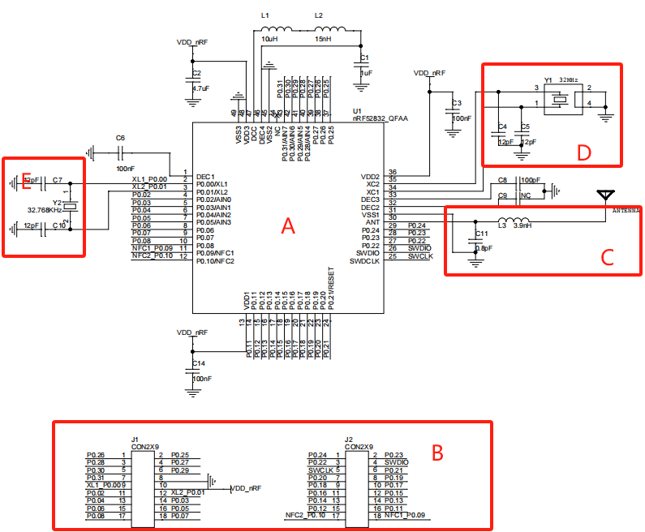
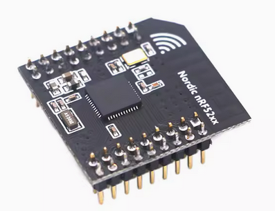
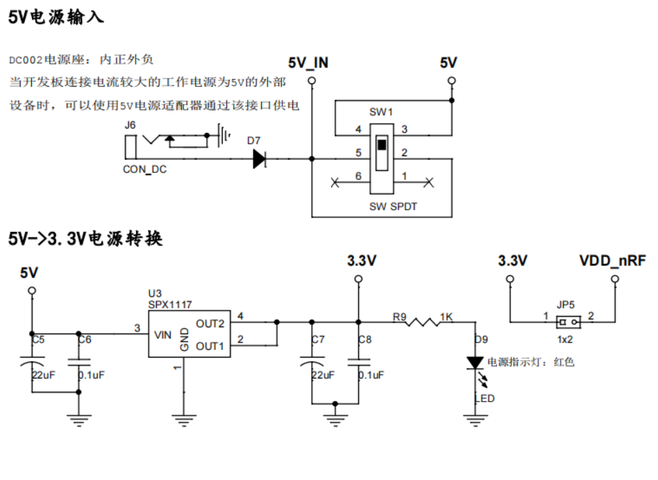
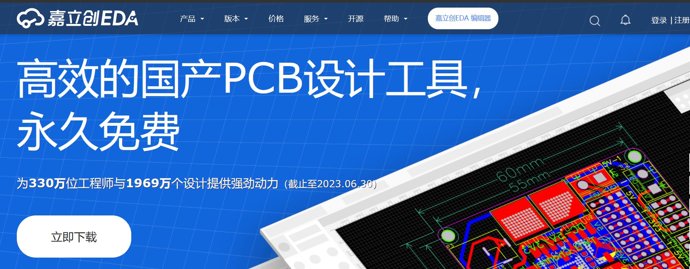
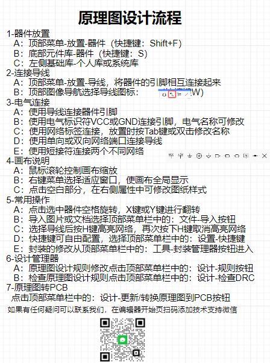

# 基础硬件设计

## 它山之石可以攻玉

通过学习别人的开发，研究出一套适合自己的开发板显得尤为重要。针对入门学习，一般的开发版分为两大部分：核心板和底板，甚至一些工业评估板也是采用这类思路（近期采购的北斗短报文evb、思澈科技evb和RTK差分评估板等）。课程购买淘宝上销量较高的开发为例，展开讨论，形成自己的知识库。

### 核心板原理图

核心模块一般也称为最小系统，仅包含必要外设，同时所有可用IO全部引出。

1. （A）蓝牙单片机nRF52832部分（官网查阅资料，熟悉其特性与规格书 https://www.nordicsemi.com/Products/nRF52832 ），一般从RAM和ROM大小、主频多少、外设丰富程度和功耗等环节评估一颗料是否满足项目需求。
2. （B）对外IO接口部分，引出所有可用的IO（若做特殊功能评估，时间紧急可以只引出需要的IO），一定不要漏掉下载口和一些特殊的调试口，否则调试时非常麻烦。
3. （C）天线部分，从射频引脚PIN30出来到传输线之间，要经过一段匹配网络，这段匹配网络的主体是一个π型滤波网络（C11，L3，？？）和一个隔直电容（？？）。
4. （D）外部系统晶振部分，根据规格书选择合适的即可。
5. （E）时钟部分，作为RTC的驱动源，一般选择32.768KHz。

### 底板原理图

重点关注CON_DC接口类型，SW1的开关原理，SPX117的输入/输出电气特性，JP5的作用。画原理图时考虑清楚选用哪类封装（0603？0402？）。详细的完整原理图移步至PDF完整版分析讨论。

## 自研基础开发板

首次画自己的开发板，建议核心模块使用第三方（尤其是涉及射频部分的核心模块，请先跳过自研）。打造自己的学习版，应具备如下基础硬件单元：

1. 核心模块接口部分（模块使用第三方），考虑接口类型，第三方核心模块接口一般为排针或邮票孔类型；考虑是2.0mm吗？2.54mm吗？还是非标间距，询问厂家索要规格书或者封装库。引出核心模块的所有IO，方便调试与监控。

2. 电源模块部分，5V转3.3V，microUSB供电？Type-C供电？排针供电？引出排针给外部供电？

3. 下载调试口部分，JTAG？SWD？标准接口还是排针？

4. 基础通信接口部分，一般选择UART（TTL转USB）。

5. 按键与LED部分。

6. 传感器模块部分，选用arduino或E53。
    【完成课程作业】

## 立创EDA基本使用

国产EDA的发展潜力巨大，随着核心技术的国产化趋势加剧。掌握一门国产的EDA软件使用尤为重要。那么针对本专业的特点，选择简单易用的EDA尤为重要，能将软硬件设计效率提升数倍。该EDA与其它的EDA不同之处在于，其支持云端设计与绘图，浏览器直接输入 https://lceda.cn/ 即可注册登录。

云端EDA让设计者不再局限于个人的设计，而是最大限度地发挥网络的优势。设计者可以在立创EDA上实现团队管理、原理图库管理和PCB库管理与共享，以及在“开源”查找工程等一系列快捷功能。这是行业颠覆式EDA，这是在打造全球EDA生态，尽早融入生态，能尽早进入行业。
**1）库文件共享**
目前立创EDA有上百万个元件原理图库和PCB库，除了立创商城所售元件的库，绝大部分共享库是由用户提供的。随着立创EDA的用户数量不断增加，云端的库文件也不断更新和积累，目前在立创EDA上基本可以找到用户所需的大多数元件及其对应的元件库，不仅省去了自己制作封装的麻烦，而且大大提升了设计效率。
**2）团队管理**
立创EDA提供非常强大的团队管理功能。设计者通过创建一个团队，将成员加入其中并赋予权限，就可以共同对工程进行设计，并且在工程设计中实现分工协作，提高设计效率。通过团队管理的方式让团队成员对一个工程有更深人的理解，有助于工程的完善，体现团队协作的优势。在团队管理中，工程文件同样可以设置版本管理的功能，团队成员之间可以就一个项目设计多个版本，不同的团队成员可以设计不同的版本，有助于促进相互间的学习、交流和进步。
**3）开源广场**
工程师将自己的工程文件开源后便可以与其他用户一起交流，这是一种良性的学习方式。他人通过对自己的开源工程进行学习和研究，可能会提出一种更好的解决方案。开源的工程文件也可能会对其他工程师的工程设计有参考和借鉴作用。立创EDA提供了一个硬件开源的平台 - - 开源广场。
**4）版本管理**
版本号表示一个工程项目在更新迭代中的唯一性。类似前面课程讲述的git版本管理，该功能是开创性的，需要自行进一步研究。

嘉立创EDA目前有两个版本，立创EDA专业版和立创EDA标准版。嘉立创EDA专业版是立创EDA团队花费一年的时间，全力打造的一个全新的版本，在 2019 年末推出，请以一个新的工具来对待，立创EDA标准版的某些功能和宽松限制不一定会提供。 嘉立创EDA专业版的数据和立创EDA标准版的数据不互通。

**嘉立创EDA专业版提供了一个器件概念，器件 = 符号 + 封装 + 3D模型 + 属性参数，以实现高度复用，只允许放置器件在原理图画布中。**

详细使用一起阅读文档教程 https://prodocs.lceda.cn/cn/introduction/introduction/index.html

## 原理图设计

详细参考 https://prodocs.lceda.cn/cn/schematic/settings-schematic/index.html 
