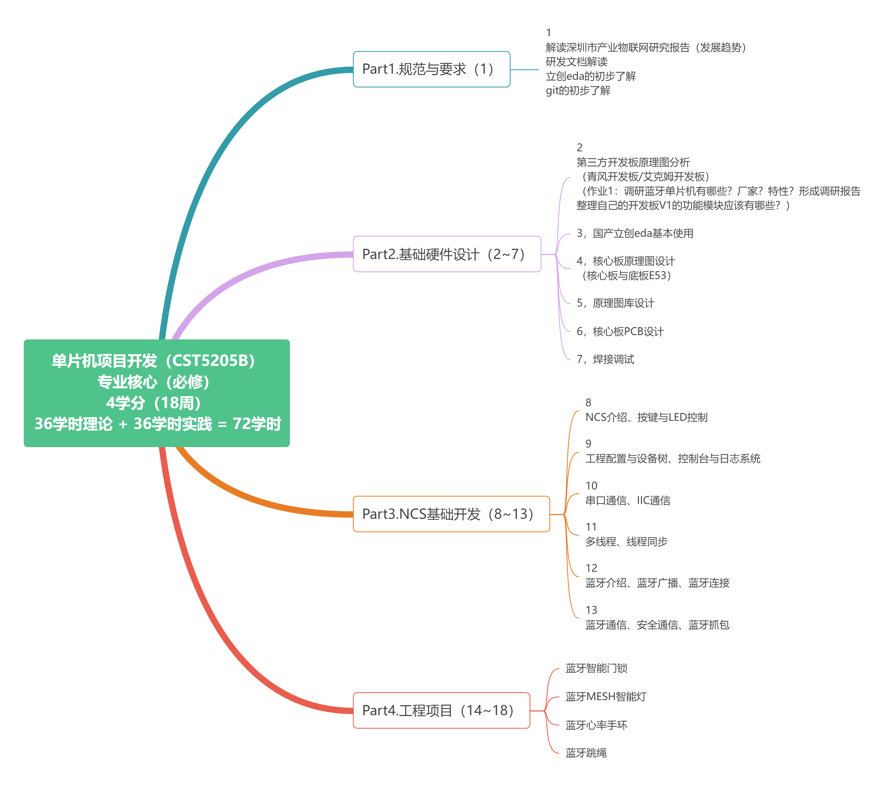
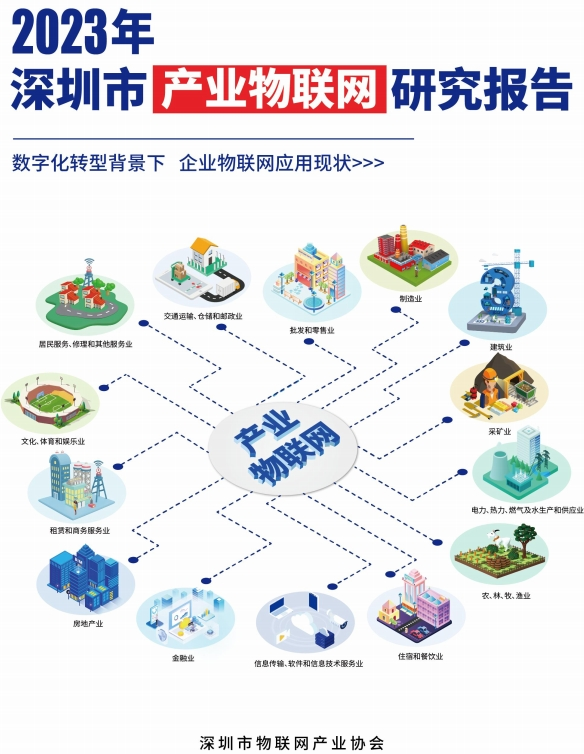
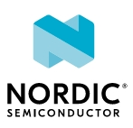
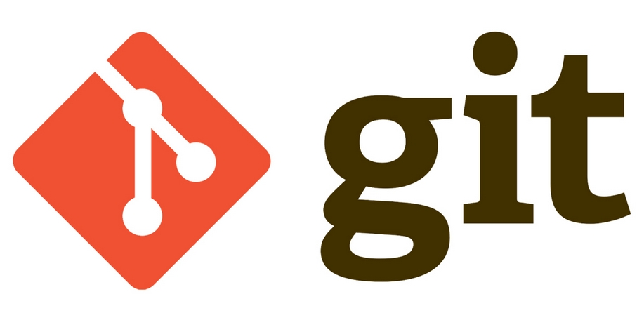
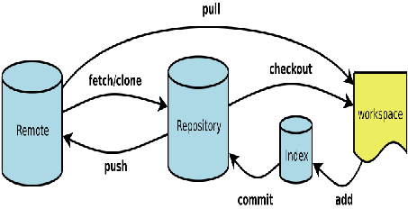

# 课程概要

***学情调研：***

你心目中的嵌入式专业应该是怎么样子的？嵌入式工程师日常是怎么样的工作？自己未来的职业是怎么样子的，它和AI有什么关联？

8051单片机的知识点还记得哪些？温故而知新。

C语言中，你认为什么最好理解？什么最难理解？（除课本外，你还阅读了哪些和C语言相关的资料）

***内容概览：***

本课程将分为两个主要模块：**硬件设计和软件开发**。在硬件设计模块中，将学习硬件架构、设计方法和有关Nordic平台的基本原理（最小系统）。在软件开发模块中，重点介绍Zephyr实时操作系统的基本概念、特性和应用，将学习如何使用Zephyr进行单片机系统的软件开发，最终实现课程期末的考查。

***课程目标：***

- 掌握Nordic平台的**硬件设计**： 通过理论讲解和实践操作，掌握Nordic系列芯片的基本特性和外围设备的选型与接口设计方法，具备设计和调试Nordic平台硬件电路的能力。
- 熟悉Zephyr**实时操作系统**的开发：学习Zephyr实时操作系统的基本概念和架构，以及在Zephyr环境下进行蓝牙协议相关的软件开发技术。
- 具备单片机**系统设计与开发能力**： 通过课程的学习和项目实践，掌握Nordic平台硬件设计和Zephyr实时操作系统开发的基本技能，具备独立设计和开发单片机系统的能力。

***课程特色：***

- 项目驱动： 课程采用项目驱动的教学方法，将理论知识与实践项目相结合，通过实际项目的设计和开发，提高问题解决能力和综合应用能力。

- 导师指导： 课程配备专业的导师团队，提供个性化的学习指导和解答疑惑（创新中心307办公室）。




随着项目学习的情况，教学内容会动态调整。

## 深圳市产业物联网发展趋势



## 研发管理规范


团队协作是实现共同目标的关键。通过协作，团队成员能够共享知识、技能和资源，有效地分工合作，提高工作效率。协作可以激发创新和灵感，促进问题解决和决策制定。团队协作还可以增强团队凝聚力和信任感，促进成员之间的沟通和合作，建立良好的工作氛围。最终，团队协作可以带来更好的成果和绩效，实现组织的长期成功。**（文档撰写规范、代码命名规范等）**

## NCS简介



NCS（Nordic Connect SDK）是由Nordic Semiconductor推出的一款软件开发工具包（SDK），专门用于开发基于其无线系统芯片（如nRF52系列）的应用程序。NCS提供了丰富的软件组件和工具，旨在简化嵌入式应用程序的开发过程，并提高开发效率和可靠性。

NCS的一些主要特点和功能：

1. **全面的软件组件库**：NCS提供了丰富的软件组件库，包括BLE（低功耗蓝牙）、Thread、ZigBee、NFC（近场通信）、TCP/IP 等协议栈，以及各种外设驱动和中间件。
2. **多种开发工具**：NCS支持多种开发工具，包括Segger Embedded Studio、GCC、IAR Embedded Workbench等。开发者可以根据自己的喜好和需求选择合适的开发工具。
3. **易于使用的 API**：NCS提供了简洁清晰的API，使开发者能够轻松地访问各种硬件功能和协议栈功能，快速实现应用程序的功能。
4. **模块化设计**：NCS采用模块化设计，开发者可以根据项目需求选择所需的功能模块，同时还可以方便地扩展和定制功能。
5. **示例代码和文档**：NCS提供了丰富的示例代码和详细的文档，帮助开发者快速入门并解决开发过程中的问题。

## 立创EDA简介


EDA（Electronic Design Automation，电子设计自动化），常用的如： Altium Designer、Orcad、Pads等。嘉立创EDA（https://lceda.cn） 隶属于深圳嘉立创科技集团股份有限公司，是由嘉立创EDA团队开发，国内版为嘉立创EDA(曾用名立创EDA)，国外版为EasyEDA。基于JavaScript，完全由中国团队独立研发，并拥有完全的独立自主知识产权的板级EDA工具。

## Git简介



Git是一个分布式版本控制系统，最初由Linus Torvalds为了管理Linux内核开发而创建。它允许多人协作开发项目，跟踪文件的变化，以及管理项目的版本。以下是Git的一些关键特点和概念：

1. **分布式版本控制**：每个开发者都可以在本地完整复制整个代码仓库，不依赖于中央服务器。这种分布式架构使得Git更加灵活和高效。
2. **快速**：Git设计时注重性能，因此操作速度很快，即使在大型项目中也能快速处理。
3. **分支**：Git支持轻量级的分支操作，允许开发者创建、合并和删除分支。这使得团队能够并行开发不同的功能和修复bug，而不会相互影响。
4. **版本追踪**：Git能够跟踪文件的每一次修改，包括添加、删除和修改。开发者可以方便地查看文件的历史版本，并回退到任意历史状态。
5. **协作和远程仓库**：开发者可以将本地仓库与远程仓库进行同步，从而实现团队协作。Git提供了多种协作方式，如拉取（pull）、推送（push）、合并（merge）等。
6. **开源**：Git是开源的，任何人都可以免费使用和修改。它的开源性质使得社区能够共同完善和改进Git，为用户提供更好的版本控制体验。

总的来说，Git是一个强大的版本控制系统，它在许多开发项目中被广泛使用，为开发团队提供了高效、灵活和可靠的代码管理解决方案。

# Git讲解与练习

## 讲解




工作区（workerspace）、索引（index）、本地仓库（repository）、远端仓库（remote）的基本概念。

- 安装Git客户端（位于本地计算机，而Git服务端一般位于远程服务器[也可以是本地私有部署]），一般使用TortoiseGit这类GUI图形化工具操作，避免直接使用繁多的命令，初期学习建议使用命令。同步从网络上自行获取新版的客户端，按照安装向导进行逐步安装即可，安装完毕后，到任意目录（注意一定选用英文路径）单击鼠标右键将获取大致如下效果，打开“Git Bash Here”（在这里打开Git命令行）。


- 输入Git指令“git --version”获取Git客户端的版本，当获取类似如下的界面时，表示Git客户端安装成功。


- Git常用指令演示。帮助指令“git --help”，使用该指令查阅当前所有支持的命令（git add --help使用该指令查阅git add指令的用法）：

```
git init初始化一个本地仓库；

git add .添加本地文件/夹到缓存区（可以缓存多次）；

git commit -m “首次提交工程文件”从缓存区提交到本地仓库；

git remote add origin git@gitee.com:laizx/class_com.git将本地仓库与远程仓库进行关联；

git push origin将本地仓库的文件推送到远程仓库；

git pull从远程仓库拉取到本地（当开发协作者推送后，本地就会增加文件，强烈建议每天工作时，首先执行该指令）；

git log查看提交的备注（commit）；

git branch -b new_test_prj从当前分支中创建一个测试分支。
```

- 到Gitee.com注册自己的远程仓库账号，并配置SSH，实现远程与本地建立安全连接。

本地修改并同步到远程服务器。经过此上述步骤的理解Git的整体使用。

（参考https://blog.csdn.net/mukes/article/details/115693833  https://blog.csdn.net/javaargs/article/details/116309643   https://blog.csdn.net/Kwan_9595/article/details/118163784 ）

Git学习：
https://www.bootcss.com/p/git-guide/
https://www.jianshu.com/p/d220c88bb516

MD学习：
https://markdown.com.cn/basic-syntax/

## 练习

1. 强化练习Git的使用。
2. 将本周练习过程记录到在线文档，形成自己的知识库。
