# 中阶开发训练营教学内容


# 构建开发环境
## 从NCS2.5.0升级到NCS2.9.0版本

升级VS Code为最新版本，升级nRF Connect插件为最新版本。成功后，打开SDK路径的效果图如下，也可根据插件罗列的版本，选择其它版本的SDK。

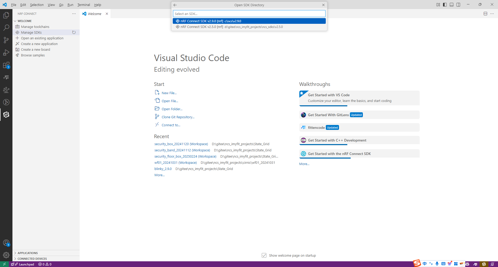

## 下载blinky工程验证硬件

选择“Create a new application” -> “Copy a sample" -> "nRF Connect SDK v2.9.0" -> "blink"，选择”Blinky Sample“。构建配置信息如下：

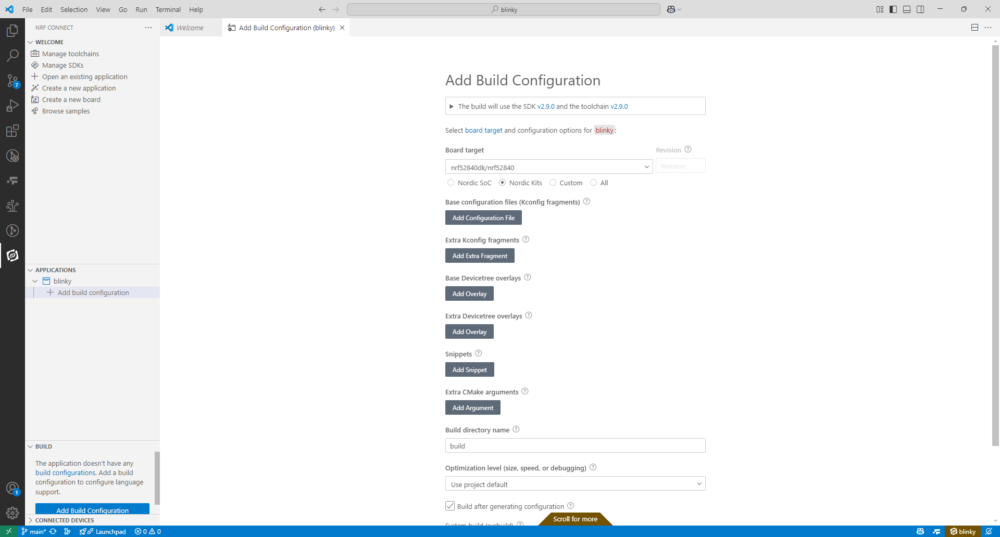

注意开启构建终端窗口，方便查看构建的过程是否有错误。下载到evb后看到led周期性闪烁，证明开发环境已经升级完成。构建“Hello World“工程验证串口日志输出是否正常。综合起来判定硬件的基础完整性。

## Qemu模拟开发

在很多开发场景下需要多人分工联合开发，尤其是驱动与业务分模块化框架中，完全剥离驱动和业务，此时可采用QEMU虚拟机仿真开发***应用程序业务模块***。Qemu是一个开源的托管虚拟机，通过纯软件来实现虚拟化模拟器，几乎可以模拟任何硬件设备。比如：Qemu可以模拟出一个ARM系统中的：CPU、内存、IO设备等，然后在这个模拟层之上，可以跑一台ARM虚拟机，这个ARM虚拟机认为自己在和硬件进行打交道，但实际上这些硬件都是Qemu模拟出来的。

### 环境搭建

进入链接下载虚拟机， https://qemu.weilnetz.de/w64/2025/qemu-w64-setup-20250210.exe ，或者网络搜索下载。安装到某个路径，例如：“D:\soft\qemu”：

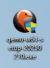

同时设置path环境变量，例如：D:\soft\qemu（根据自己的安装路径设置，如果不清楚环境变量如何配置，请在大模型里面提问解决），如下：

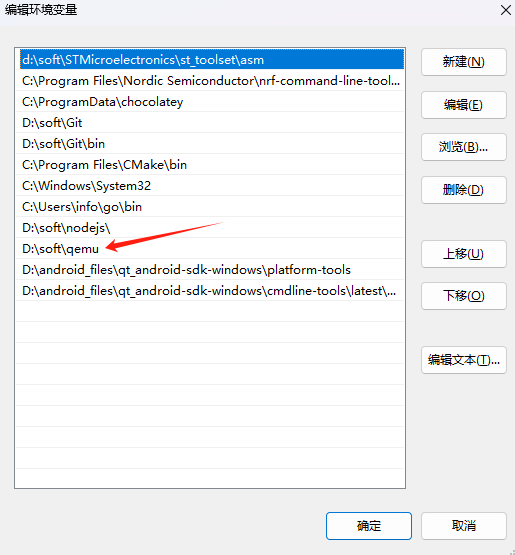

进入命令行运行“qemu-system-i386 --version”，输出如下图所示结果，表示基础环境已经搭建好了。

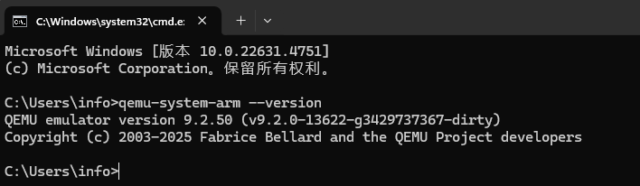

### 构建工程验证

根据前文描述的”Hello World“工程构建，注意选择M3内核平台的TI的LM3S6965，此时无法选择Nordic平台，如下图：

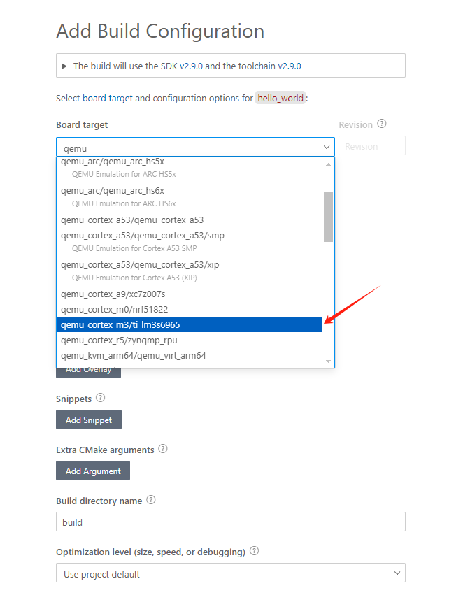

在构建后的路径（例如：D:\gitee\ncs_imyfit_projects\tfswufe\tf\hello_world\build\hello_world\zephyr），确保能找到zephyr.elf文件。从命令行CMD中切换到工程目录下（例如：cd/d D:\gitee\ncs_imyfit_projects\tfswufe\tf\hello_world）：

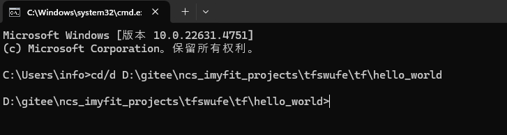

并运行“qemu-system-arm -cpu cortex-m3 -machine lm3s6965evb -kernel build/hello_world/zephyr/zephyr.elf -nographic"即可输出。

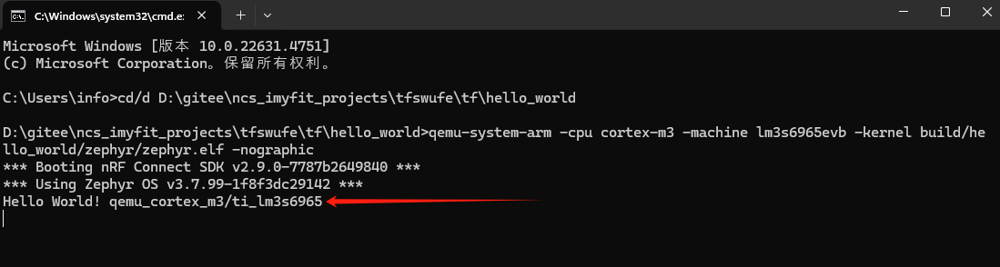

同时按住 `Ctrl` 和 `A`，**然后松开**，再按`X`退出仿真，如下图。

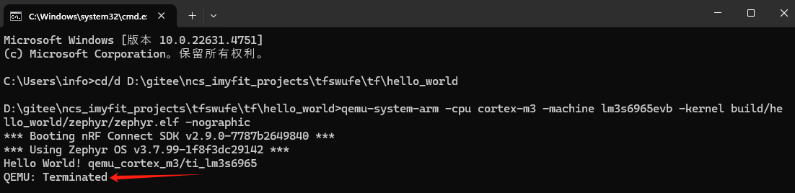

### 添加调试日志

（先真机验证调试日志是否正确配置）从新构建基于nRF52840DK的目标板，选择时注意下图中的红色箭头，如下图：

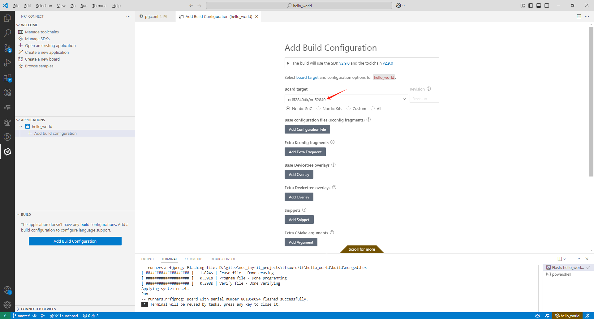

添加、修改必要的基础代码如下：

prj.conf文件中添加如下配置信息

```
# ----------------------------------LOG功能配置
CONFIG_LOG=y
# CONFIG_LOG_BACKEND_SHOW_COLOR=y
# CONFIG_LOG_INFO_COLOR_GREEN=y
CONFIG_USE_SEGGER_RTT=n
# 使用jlink的rtt作为LOG的后端(使能了SHELL,这里必须为n)
CONFIG_LOG_BACKEND_RTT=n
# 使用uart作为LOG的后端(使能了SHELL,这里必须为n)
CONFIG_LOG_BACKEND_UART=n
CONFIG_LOG_BUFFER_SIZE=8096
# 使用ble作为LOG的后端
# CONFIG_LOG_BACKEND_BLE=y
# 使能文件系统作为LOG的后端
CONFIG_LOG_BACKEND_FS=n
# 去掉HCI相关日志
CONFIG_BT_HCI_CORE_LOG_LEVEL_OFF=y
CONFIG_BT_HCI_DRIVER_LOG_LEVEL_OFF=y
# ----------------------------------CONSOLE功能配置
CONFIG_CONSOLE=y
CONFIG_RTT_CONSOLE=n
CONFIG_UART_CONSOLE=n
CONFIG_PRINTK=y
# ----------------------------------SHELL功能配置
# 使能shell(SHELL和LOG默认使用相同的通道)
CONFIG_SHELL=y
CONFIG_SHELL_BACKENDS=y
CONFIG_SHELL_BACKEND_RTT=n
CONFIG_SHELL_BACKEND_SERIAL=y
CONFIG_SHELL_BACKEND_DUMMY=n
CONFIG_SHELL_MINIMAL=n
CONFIG_SHELL_STACK_SIZE=4096
CONFIG_THREAD_MONITOR=y
CONFIG_THREAD_NAME=y
CONFIG_SHELL_PROMPT_RTT=""
CONFIG_SHELL_HELP=y
```

main.c文件中修改代码适配串口日志输出

```
#include <stdio.h>
#include <zephyr/kernel.h>

#include <zephyr/shell/shell.h>
#include <zephyr/logging/log.h>
LOG_MODULE_REGISTER(main, LOG_LEVEL_DBG);

int main(void)
{
	// printf("Hello World! %s\n", CONFIG_BOARD_TARGET);
	uint8_t cnt = 0;
	while (1)
	{
		k_sleep(K_SECONDS(1));
		LOG_DBG("cnt = %d", cnt++);
	}
	return 0;
}
```

编译代码，下载到WK_TEST开发板，连接Type-C，打开Xshell连接查看真机日志，如下图，完成真机添加调试日志。

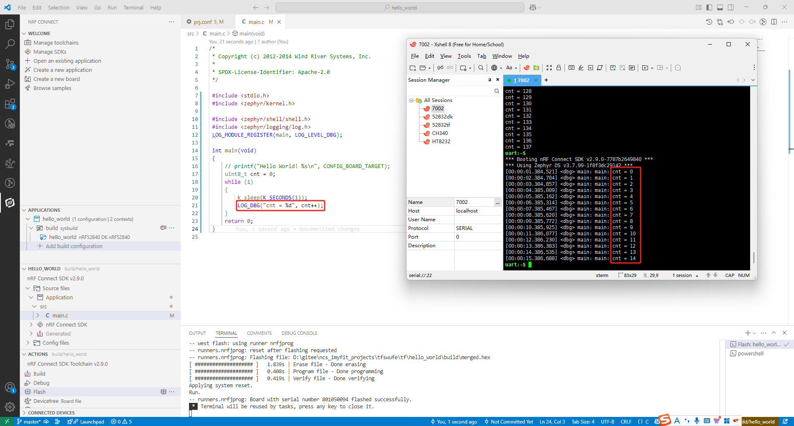

从新构建虚拟仿真需要的目标板lm3s6965evb（构建目录为了和真机进行区分从新设置目录为build_qemu，所以产生的可执行文件elf的路径就变为**build_qemu/hello_world/zephyr/zephyr.elf**），构建成功后在命令行中输入指令 `qemu-system-arm -cpu cortex-m3 -machine lm3s6965evb -kernel build_qemu/hello_world/zephyr/zephyr.elf -nographic` 。运行效果如下图，证明虚拟机添加调试日志已经成功。

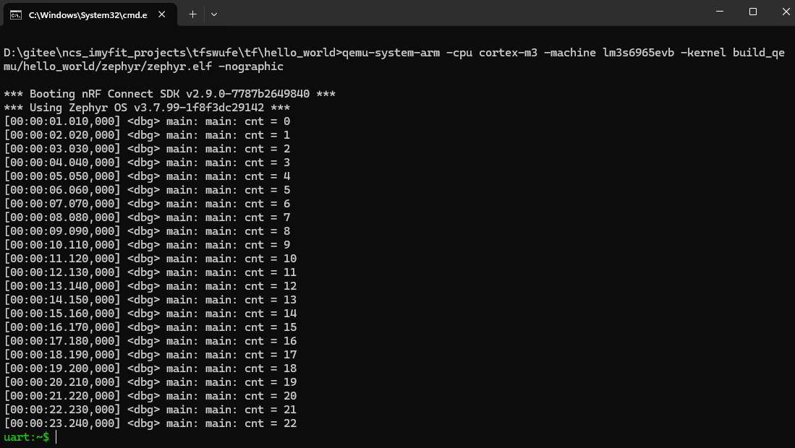

> **本周练习要求**
>
> - 请结合大模型和NCS官网资料，基于上述模板添加shell输入输出功能，实现一个加法器，命令行中输入`add 1 2`控制台输出`sum=3`，为后续的项目开发调试搭建环境。
> - 请仿真实现业务逻辑：手环充电过程中有2个与充电状态量。状态量1：插入充电器芯片输出`1`，拔掉充电器芯片输出`0`。状态量2：充电中芯片输出`0`，充电完成或未充电芯片输出`1`。请结合真值表方法给出：手环充电过程中红灯快闪烁，充满绿灯常亮。（拓展：低电量时红灯慢闪，蓝牙通信与定位关闭；电量充足时蓝牙通信与定位开启）
> - 课后研究：根据自己熟悉的Cortex-M3平台（例如：stm32f4和esp32等），实现“Hello World”仿真输出，体会仿真开发的优劣。

# 蓝牙手环从机广播通信

# 蓝牙手环从机心率计步和电量服务
# Zephyr多线程
# 蓝牙网关主机设计
# 蓝牙网关主机设计-多从机连接模式
# 智慧幼儿园健康数据模拟采集
