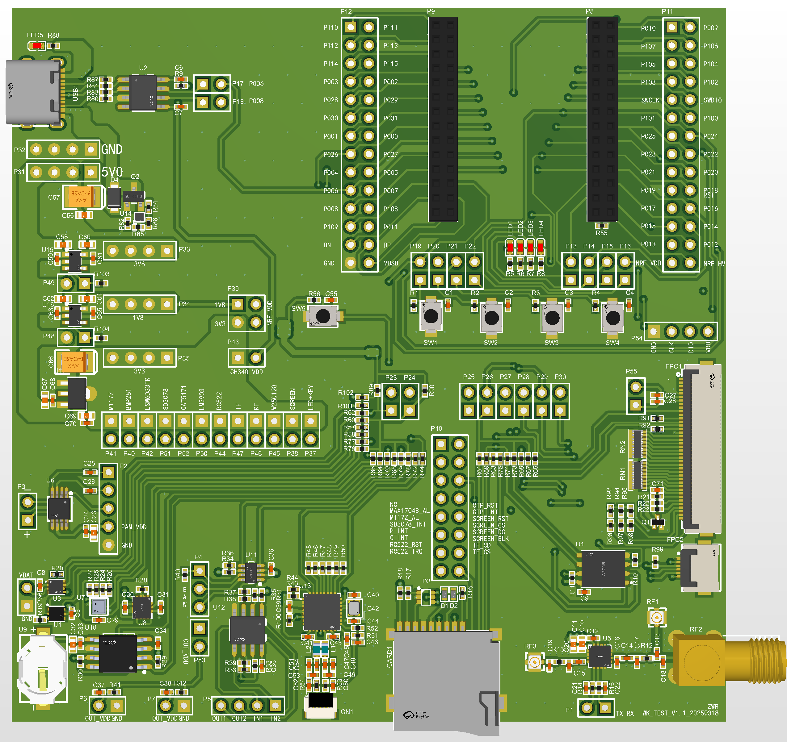
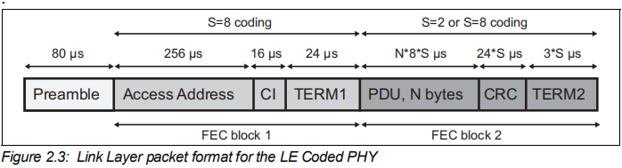
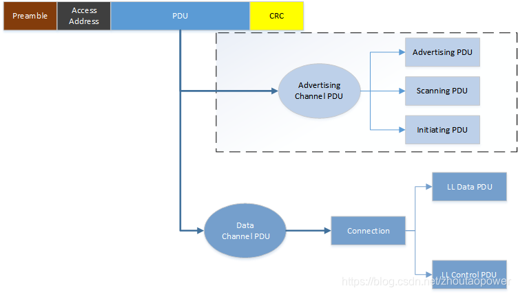
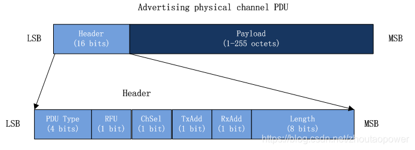
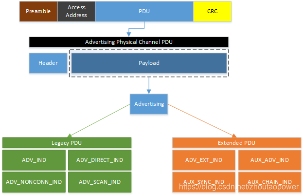
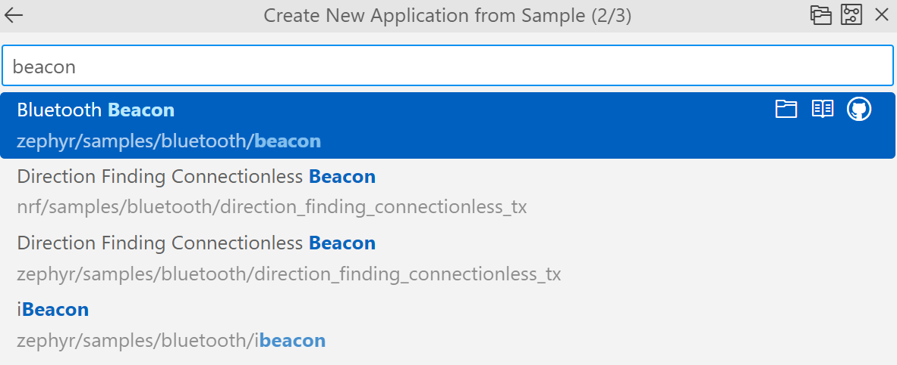
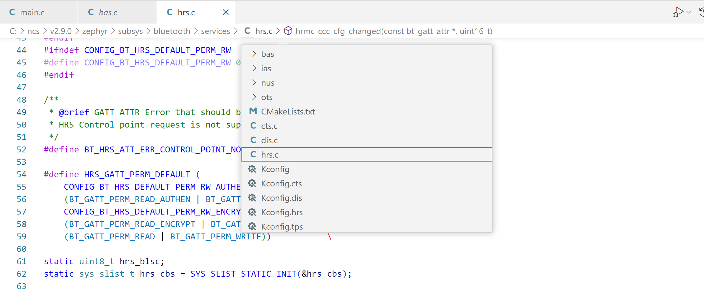

# 中阶开发训练营教学内容


# 构建开发环境
## 从NCS2.5.0升级到NCS2.9.0版本

升级VS Code为最新版本，升级nRF Connect插件为最新版本。成功后，打开SDK路径的效果图如下，也可根据插件罗列的版本，选择其它版本的SDK。


## 下载blinky工程验证硬件

选择“Create a new application” -> “Copy a sample" -> "nRF Connect SDK v2.9.0" -> "blink"，选择”Blinky Sample“。构建配置信息如下：


注意开启构建终端窗口，方便查看构建的过程是否有错误。下载到evb后看到led周期性闪烁，证明开发环境已经升级完成。构建“Hello World“工程验证串口日志输出是否正常。综合起来判定硬件的基础完整性。

## Qemu模拟开发

在很多开发场景下需要多人分工联合开发，尤其是驱动与业务分模块化框架中，完全剥离驱动和业务，此时可采用QEMU虚拟机仿真开发***应用程序业务模块***。Qemu是一个开源的托管虚拟机，通过纯软件来实现虚拟化模拟器，几乎可以模拟任何硬件设备。比如：Qemu可以模拟出一个ARM系统中的：CPU、内存、IO设备等，然后在这个模拟层之上，可以跑一台ARM虚拟机，这个ARM虚拟机认为自己在和硬件进行打交道，但实际上这些硬件都是Qemu模拟出来的。

### 环境搭建

进入链接下载虚拟机， https://qemu.weilnetz.de/w64/2025/qemu-w64-setup-20250210.exe ，或者网络搜索下载。安装到某个路径，例如：“D:\soft\qemu”：


同时设置path环境变量，例如：D:\soft\qemu（根据自己的安装路径设置，如果不清楚环境变量如何配置，请在大模型里面提问解决），如下：


进入命令行运行“qemu-system-i386 --version”，输出如下图所示结果，表示基础环境已经搭建好了。


### 构建工程验证

根据前文描述的”Hello World“工程构建，注意选择M3内核平台的TI的LM3S6965，此时无法选择Nordic平台，如下图：


在构建后的路径（例如：D:\gitee\ncs_imyfit_projects\tfswufe\tf\hello_world\build\hello_world\zephyr），确保能找到zephyr.elf文件。从命令行CMD中切换到工程目录下（例如：cd/d D:\gitee\ncs_imyfit_projects\tfswufe\tf\hello_world）：


并运行“qemu-system-arm -cpu cortex-m3 -machine lm3s6965evb -kernel build/hello_world/zephyr/zephyr.elf -nographic"即可输出。


同时按住 `Ctrl` 和 `A`，**然后松开**，再按`X`退出仿真，如下图。


### 添加调试日志

（先真机验证调试日志是否正确配置）从新构建基于nRF52840DK的目标板，选择时注意下图中的红色箭头，如下图：


添加、修改必要的基础代码如下：

prj.conf文件中添加如下配置信息

```
# ----------------------------------LOG功能配置
CONFIG_LOG=y
# CONFIG_LOG_BACKEND_SHOW_COLOR=y
# CONFIG_LOG_INFO_COLOR_GREEN=y
CONFIG_USE_SEGGER_RTT=n
# 使用jlink的rtt作为LOG的后端(使能了SHELL,这里必须为n)
CONFIG_LOG_BACKEND_RTT=n
# 使用uart作为LOG的后端(使能了SHELL,这里必须为n)
CONFIG_LOG_BACKEND_UART=n
CONFIG_LOG_BUFFER_SIZE=8096
# 使用ble作为LOG的后端
# CONFIG_LOG_BACKEND_BLE=y
# 使能文件系统作为LOG的后端
CONFIG_LOG_BACKEND_FS=n
# 去掉HCI相关日志
CONFIG_BT_HCI_CORE_LOG_LEVEL_OFF=y
CONFIG_BT_HCI_DRIVER_LOG_LEVEL_OFF=y
# ----------------------------------CONSOLE功能配置
CONFIG_CONSOLE=y
CONFIG_RTT_CONSOLE=n
CONFIG_UART_CONSOLE=n
CONFIG_PRINTK=y
# ----------------------------------SHELL功能配置
# 使能shell(SHELL和LOG默认使用相同的通道)
CONFIG_SHELL=y
CONFIG_SHELL_BACKENDS=y
CONFIG_SHELL_BACKEND_RTT=n
CONFIG_SHELL_BACKEND_SERIAL=y
CONFIG_SHELL_BACKEND_DUMMY=n
CONFIG_SHELL_MINIMAL=n
CONFIG_SHELL_STACK_SIZE=4096
CONFIG_THREAD_MONITOR=y
CONFIG_THREAD_NAME=y
CONFIG_SHELL_PROMPT_RTT=""
CONFIG_SHELL_HELP=y
```

main.c文件中修改代码适配串口日志输出

```
#include <stdio.h>
#include <zephyr/kernel.h>

#include <zephyr/shell/shell.h>
#include <zephyr/logging/log.h>
LOG_MODULE_REGISTER(main, LOG_LEVEL_DBG);

int main(void)
{
	// printf("Hello World! %s\n", CONFIG_BOARD_TARGET);
	uint8_t cnt = 0;
	while (1)
	{
		k_sleep(K_SECONDS(1));
		LOG_DBG("cnt = %d", cnt++);
	}
	return 0;
}
```

编译代码，下载到WK_TEST开发板，连接Type-C，打开Xshell连接查看真机日志，如下图，完成真机添加调试日志。


从新构建虚拟仿真需要的目标板lm3s6965evb（构建目录为了和真机进行区分从新设置目录为build_qemu，所以产生的可执行文件elf的路径就变为**build_qemu/hello_world/zephyr/zephyr.elf**），构建成功后在命令行中输入指令 `qemu-system-arm -cpu cortex-m3 -machine lm3s6965evb -kernel build_qemu/hello_world/zephyr/zephyr.elf -nographic` 。运行效果如下图，证明虚拟机添加调试日志已经成功。


> **本周练习要求**
>
> - 请结合大模型和NCS官网资料，基于上述模板添加shell输入输出功能，实现一个加法器，命令行中输入`add 1 2`控制台输出`sum=3`，为后续的项目开发调试搭建环境。
>
>   ```
>   基于Hello World工程添加如下代码:
>    /**
>     * @brief 加法函数
>     * 
>     * @param sh 
>     * @param argc 
>     * @param argv 
>     * @return int 
>     */
>    static int cmd_add(const struct shell *sh, size_t argc, char **argv)
>    {
>   	 int a = atoi(argv[1]);
>   	 int b = atoi(argv[2]);
>   	 int c = a + b;
>   	 LOG_DBG("a + b = %d", c);
>   	 return 0;
>    }
>    SHELL_CMD_REGISTER(add, NULL, "add two numbers", cmd_add); 
>   ```
>
> - 请仿真实现业务逻辑：手环充电过程中有2个与充电状态量。状态量1：插入充电器芯片输出`1`，拔掉充电器芯片输出`0`。状态量2：充电中芯片输出`0`，充电完成或未充电芯片输出`1`。请结合真值表方法给出：手环充电过程中红灯快闪烁，充满绿灯常亮。（拓展：低电量时红灯慢闪，蓝牙通信与定位关闭；电量充足时蓝牙通信与定位开启）
>
>   ```
>   // usb充电器是否插入,0x01表示插入,0x00表示未插入
>   uint8_t usb_is_plugged = 0x01 & dat.status;
>   // 是否在充电状态,0x00表示充电中,0x01表示未充电或已经充满
>   uint8_t charge = 0x01 & (dat.status >> 1);
>   
>   // 检查状态变化并更新日志输出
>   if (usb_is_plugged != prev_usb_plugged || charge != prev_charge)
>   {
>       // 根据 usb_is_plugged 和 charge 的组合情况输出日志并更新 LED
>       if (usb_is_plugged == 1 && charge == 0 && charge_finished == 0) // 充电器插入，充电中
>       {
>           ((wk_device_led_t *)_led_dev_obj)->set_led(1, 1); // led1亮
>           ((wk_device_led_t *)_led_dev_obj)->set_led(2, 0); // led2灭
>           LOG_I("Charging (usb connected)");
>       }
>       else if (usb_is_plugged == 1 && charge == 1) // 充电器插入，充电完成
>       {
>           ((wk_device_led_t *)_led_dev_obj)->set_led(1, 0); // led1灭
>           ((wk_device_led_t *)_led_dev_obj)->set_led(2, 1); // led2亮
>           LOG_I("Charging complete (usb connected)");
>           charge_finished = 1;
>       }
>       else if (usb_is_plugged == 0 && charge == 1) // 充电器未插入，电池充满
>       {
>           ((wk_device_led_t *)_led_dev_obj)->set_led(1, 0); // led1灭
>           ((wk_device_led_t *)_led_dev_obj)->set_led(2, 0); // led2灭
>           LOG_I("Not charging (usb disconnected)");
>           charge_finished = 0;
>       }
>       // 更新状态记录
>       prev_usb_plugged = usb_is_plugged;
>       prev_charge = charge;
>   }
>   charge_finished解决充满后状态不确定时,反复充时,灯亮灭异常效果
>   ```
>
> - 课后研究：根据自己熟悉的Cortex-M3平台（例如：stm32f4和esp32等），实现“Hello World”仿真输出，体会仿真开发的优劣。

## WK_TEST开发板介绍



### 电源

Type-C供电与通信调试，5V电源稳压分成三路：3.6V模拟锂电池电压、1.8V单片机和部分传感器（eg：BMP581）可使用该电压供电进一步降低功耗、3.3V单片机和传感器供电。可单独给各个外设模块断电和断IO口，方便做低功耗测试，评估穿戴设备的待机时间。

### 外设

灯（LED1~LED4）、按键（SW1~SW4）、功率放大器RF2401C（U5）、三加计三陀螺传感器LSM6DS3TR-C（U8）、气压传感器BMP581（U7）、温度传感器M117Z（U1）、TF存储（CARD1）、时钟传感器SD3078（U10）、电子电位器CAT5171TBI（U11）与比较器LM2930（U12）、串口通信（CH340N）、2.5W 单声道 D 类音频功放PAM8302（U6）、NFC读卡器RC522（U13）、电量计MAX17048（U3）、3.2英寸TFT显示屏接口（FPC1）、存储颗粒W25Q128（U4）。

# 蓝牙手环从机广播通信

## 空口数据包的最基本格式

> 参考链接：https://blog.csdn.net/zhoutaopower/article/details/94676596

BLE 在空中进行数据传送，在 Spec 中称之为 Air Interface packets，俗称空口包，遵循一定的数据格式。在 BLE 4.2 的时代，仅仅支持 1M 的 Symbol rate，随着蓝牙标准的发展，BLE 5.0 不仅仅支持了 1M PHY，同时引入了 2M PHY 和 Coded PHY（500kbps 和 125kbps），Coded PHY 的数据传送，又称 Long Range，能够支持更远的数据传送。

    Uncoded PHY：1M、2M
    Coded PHY： 500kbps、125kbps

### Uncoded PHY 空口包格式

什么叫 Uncoded PHY 呢？指的就是传送数据的时候，数据实打实的，**未经过额外的编码**。数据的格式如下所示：


> Preamble ----------------------------空口包的前导码
> Access Address -------------------接入地址，用来标示接收者ID或者空中包身份
> PDU -----------------------------------protocol data unit 协议数据单元
> CRC ----------------------------------- PDU 的 24 bits CRC 计算值，用于校验数据正确性
> Constant Tone Extension ---- CTE 可选项，BLE 5.1 引入

Preamble 指的是前导的意思，BLE 数据传送中，最先传输的部分，可用于低功耗唤醒等。Access Address 成为接入地址（与设备的6个MAC地址不一样）。用来标示接收者ID或者空中包身份，根据 Access Address 的不同，又区分两种 Packet 类型：广播包和数据包：

    广播包Access Address固定为0x8E89BED6，广播包只能在广播信道（channel）上传输，即只能在37/38/39信道上传输（注：从蓝牙5.0开始广播包可以在其它信道上传输）。广播包发送给附近所有的observer（扫描者）。数据包Access Address为一个32bit的随机值，由Initiator生成。数据包只在数据信道上传输，即除37/38/39之外的其余37信道（BLE总共占用40个信道）。每建立一次连接，重新生成一次Access address。数据包是给连接通信使用的，即用于master和slave之间通信的。
PDU（protocol data unit，协议数据单元）是 BLE 数据传送的基本单元。CRC所有的数据传送，都有数据正确性的校验，BLE也一样，BLE 使用了24bits的CRC 来进行数据完整的说明。CRC 跟在 PDU 后， 计算包含 PDU 域的 CRC24 的数据。Constant Tone Extension是BLE 5.1 新增的，最主要的功能是 AoA/AoD （蓝牙定位）的应用，是一个可选的数据项。

### Coded PHY 空口包格式



BLE 5.0 以后，便支持了 Long Range，引入了 Coded PHY。Coded PHY 分为两种：500kbps、125kbps。所谓 Coded PHY呢，就是将数据传送的时候，不光是 raw data，而是加上了一个 FEC 向前纠错编码，使得在降低传送速率的前提下，对数据进行编码（FEC），达到数据低错的目的，以牺牲速度（低速）来换数据准确传送。

## ADV 广播

> 参考链接：https://blog.csdn.net/zhoutaopower/article/details/95104632?utm_source=app&app_version=4.16.0

广播（Advertising），之所谓称之为广播，最初的含义（BLE 4.2）是为了让其它设备发现自己的存在，也就是告诉空中的其他设备：“我在这里啊~~，这是我的地址 0xAABBCCDDEEFF ”，其它的处于 Scanning 状态的设备（一般指主机），就能够发现广播者了。广播（后面称为 ADV 或者 Adv）也分为，可连接/不可连接 ADV，可扫描/不可扫描 ADV，定向/不定向 ADV。根据不同 BLE 的版本，ADV 分为两类：

    Legacy ADV：BLE 4.2版本的ADV
    Extend ADV：BLE 5.x版本的ADV



广播的 PDU 组成主要由Header和Payload构成：


Header 由 16bits 构成，Payload 长度为 1~255 字节。

### PDU Header



### PDU Payload



## Bluetooth Beacon工程

> 目标：理解 Zephyr BLE 广播的具体代码结构与作用，掌握如何修改和定制广播内容。其中iBeacon是苹果规定的协议。



按照截图完成工程创建，使用nRF Connect手机端软件，查看广播内容。函数`int bt_enable(bt_ready_cb_t cb)`是Zephyr中初始化蓝牙协议栈的函数，`cb`是回调函数，将初始化的结果使用回调接口反馈给应用层，常用的回调函数如下：

```
static void bt_ready(int err)
{
	// 蓝牙地址数组
	char addr_s[BT_ADDR_LE_STR_LEN];
	// 蓝牙地址结构体
	bt_addr_le_t addr = {0};
	// 身份编号为1
	size_t count = 1;

	if (err) {
		printk("Bluetooth init failed (err %d)\n", err);
		return;
	}

	printk("Bluetooth initialized\n");

	/* Start advertising */
	// 开启广播：非连接身份、广播数据、广播数据长度、扫描应答数据、扫描应答数据长度
	err = bt_le_adv_start(BT_LE_ADV_NCONN_IDENTITY, ad, ARRAY_SIZE(ad),
			      sd, ARRAY_SIZE(sd));
	if (err) {
		printk("Advertising failed to start (err %d)\n", err);
		return;
	}

	/* For connectable advertising you would use
	 * bt_le_oob_get_local().  For non-connectable non-identity
	 * advertising an non-resolvable private address is used;
	 * there is no API to retrieve that.
	 */
	// 获取第一个身份的MAC地址，存于结构体addr
	bt_id_get(&addr, &count);
	// 将结构体addr里面的数据转成字符串（方便打印）
	bt_addr_le_to_str(&addr, addr_s, sizeof(addr_s));

	printk("Beacon started, advertising as %s\n", addr_s);
}
```

广播数据数据，采用三段式（LEN/TYPE/VALUE）模式，使用`BT_DATA_BYTES`宏函数实现构建广播数据项：

```
static const struct bt_data ad[] = {
	// BT_DATA_FLAGS一个标志数据项，BT_LE_AD_NO_BREDR表示设备不支持经典蓝牙bredr模式，只支持低功耗模式。
	BT_DATA_BYTES(BT_DATA_FLAGS, BT_LE_AD_NO_BREDR),
	// 表示设备支持的UUID,aa fe是Eddystone的UUID。（什么是Eddystone呢？？）
	BT_DATA_BYTES(BT_DATA_UUID16_ALL, 0xaa, 0xfe),
	// 表示服务数据。BT_DATA_SVC_DATA16表示这是一个16位的服务数据。
	BT_DATA_BYTES(BT_DATA_SVC_DATA16,
		      0xaa, 0xfe, /* Eddystone UUID */
		      0x10, /* Eddystone-URL frame type */
		      0x00, /* Calibrated Tx power at 0m */
		      0x00, /* URL Scheme Prefix http://www. */
		      'z', 'e', 'p', 'h', 'y', 'r',
		      'p', 'r', 'o', 'j', 'e', 'c', 't',
		      0x08) /* .org */
};
```

>**课堂练习**
>
>1、请充分结合ChatGPT等工具，使用`BT_DATA_BYTES`宏函数尝试实现自定义广播出自己的学号。
>
>2、使用`bt_le_adv_start`和`bt_le_adv_stop`等接口，实现动态广播当前电量。

# 蓝牙手环从机心率计步和电量服务

基于“peripheral_hr”创建工程。开启广播：

```

#if !defined(CONFIG_BT_EXT_ADV)
	printk("Starting Legacy Advertising (connectable and scannable)\n");
	err = bt_le_adv_start(BT_LE_ADV_CONN_ONE_TIME, ad, ARRAY_SIZE(ad), sd, ARRAY_SIZE(sd));
	if (err) {
		printk("Advertising failed to start (err %d)\n", err);
		return 0;
	}

#else /* CONFIG_BT_EXT_ADV */
	struct bt_le_adv_param adv_param = {
		.id = BT_ID_DEFAULT,
		.sid = 0U,
		.secondary_max_skip = 0U,
		.options = (BT_LE_ADV_OPT_EXT_ADV |
			    BT_LE_ADV_OPT_CONNECTABLE |
			    BT_LE_ADV_OPT_CODED),
		.interval_min = BT_GAP_ADV_FAST_INT_MIN_2,
		.interval_max = BT_GAP_ADV_FAST_INT_MAX_2,
		.peer = NULL,
	};
	struct bt_le_ext_adv *adv;

	printk("Creating a Coded PHY connectable non-scannable advertising set\n");
	err = bt_le_ext_adv_create(&adv_param, NULL, &adv);
	if (err) {
		printk("Failed to create Coded PHY extended advertising set (err %d)\n", err);

		printk("Creating a non-Coded PHY connectable non-scannable advertising set\n");
		adv_param.options &= ~BT_LE_ADV_OPT_CODED;
		err = bt_le_ext_adv_create(&adv_param, NULL, &adv);
		if (err) {
			printk("Failed to create extended advertising set (err %d)\n", err);
			return 0;
		}
	}

	printk("Setting extended advertising data\n");
	err = bt_le_ext_adv_set_data(adv, ad, ARRAY_SIZE(ad), NULL, 0);
	if (err) {
		printk("Failed to set extended advertising data (err %d)\n", err);
		return 0;
	}

	printk("Starting Extended Advertising (connectable non-scannable)\n");
	err = bt_le_ext_adv_start(adv, BT_LE_EXT_ADV_START_DEFAULT);
	if (err) {
		printk("Failed to start extended advertising set (err %d)\n", err);
		return 0;
	}
#endif /* CONFIG_BT_EXT_ADV */
```

心率与电量更新：

```
/* Implement notification. */
while (1) {
    k_sleep(K_SECONDS(1));

    /* Heartrate measurements simulation */
    hrs_notify();

    /* Battery level simulation */
    bas_notify();

    if (atomic_test_and_clear_bit(state, STATE_CONNECTED)) {
        /* Connected callback executed */

#if defined(HAS_LED)
        blink_stop();
#endif /* HAS_LED */
    } else if (atomic_test_and_clear_bit(state, STATE_DISCONNECTED)) {
#if !defined(CONFIG_BT_EXT_ADV)
        printk("Starting Legacy Advertising (connectable and scannable)\n");
        err = bt_le_adv_start(BT_LE_ADV_CONN_ONE_TIME, ad, ARRAY_SIZE(ad), sd,
                      ARRAY_SIZE(sd));
        if (err) {
            printk("Advertising failed to start (err %d)\n", err);
            return 0;
        }

#else /* CONFIG_BT_EXT_ADV */
        printk("Starting Extended Advertising (connectable and non-scannable)\n");
        err = bt_le_ext_adv_start(adv, BT_LE_EXT_ADV_START_DEFAULT);
        if (err) {
            printk("Failed to start extended advertising set (err %d)\n", err);
            return 0;
        }
#endif /* CONFIG_BT_EXT_ADV */

#if defined(HAS_LED)
        blink_start();
#endif /* HAS_LED */
    }
}
```

核心函数`hrs_notify();` 和`bas_notify();`实现心率和电量更新，函数内部调用系统底层接口，底层服务源代码位于`zephyr\subsys\bluetooth\services`如下图：



根据项目需要，直接提取系统底层的源代码改造为自己需要的服务即可。

> **本周练习**
>
> 请在当前从机工程`peripheral_hr`中将心率和电量两种数据添加到广播中，实现动态广播。
>
> Tips：启用定时器周期性更新广播数组，一般1秒比较合适，并合理调整广播的`interval_min ` 和`interval_max `实现低功耗。

# Zephyr多线程
# 蓝牙网关主机设计
# 蓝牙网关主机设计-多从机连接模式
# 智慧幼儿园健康数据模拟采集
